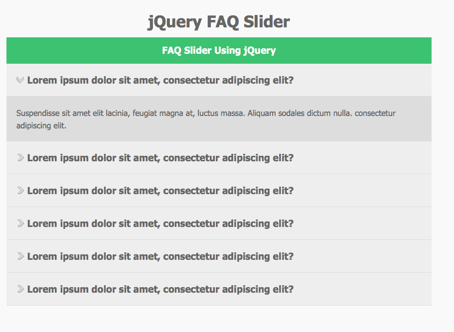

# FAQ-Accordion

Basic Practice on jQuery Accordion. This project can be used as template for future project. It has a simple event listener working based on clicking every Questions.

## FAQ-Accordion

